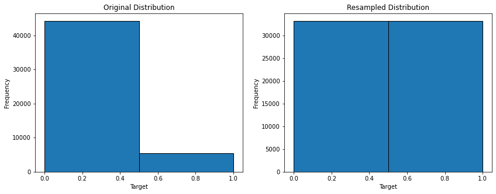

<p align="center">
  
</p>
<p align="center">
    <h1 align="center">DSC-PHASE-3-PROJECT</h1>
</p>
<p align="center">
    <em><code>► Using binary classifier on Terry Stops Dataset</code></em>
</p>
<p align="center">
	
	
	
	
<p>
<p align="center">
	<!-- default option, no dependency badges. -->
</p>

<br><!-- TABLE OF CONTENTS -->
<details>
  <summary>Table of Contents</summary><br>

- [ Overview](#-overview)
- [ Repository Structure](#-repository-structure)
- [ Data Download Instructions](#-getting-data)
- [ Data Overview](#-info-data)    
- [ Data Cleaning and Transformation](#-cleaning-data)
- [ Training Binary Classifier on Data](#-logreg-data)
- [ Conclusion](#-conclusion)
- [ License](#-license)
</details>
<hr>

##  [Overview](#-overview)

The objective is to perform an independent evaluation of the effectiveness of ongoing racial diversity training among the officers of the Seattle Police Department. The evaluation aims to identify areas that need improvement.

The solution involves using the SFPD Terry Stops Dataset to create a logistic regression model with arrest outcome as the dependent variable. This model will be interpreted as a "virtual police officer" allowing us to analyze the coefficients related to Terry Stops, officers, and subjects' demographics.


---


##  Repository Structure

```sh
└── dsc-phase-3-project/
    ├── Presentation1.pdf
    ├── README.md
    ├── Untitled.ipynb
    └── data
        ├── Race_and_Social_Equity_Composite_Index_Current_3629710440579811501.csv
        ├── SEA_Beats_Tracts_Neighborhoods.csv
        └── Terry_Stops_20240524.csv
```
---

## Datasets Download Instructions

The datasets required for this analysis are pre-downloaded into the `/data` folder:

1. **[Seattle Terry Stops](https://www.seattle.gov/police/information-and-data/data/terry-stops)**
2. **[Seattle's Racial and Social Equity Index](https://data-seattlecitygis.opendata.arcgis.com/datasets/SeattleCityGIS::racial-and-social-equity-composite-index-current-for-countywide-comparisons/about)**
3. **SEA_Beats_Tracts_Neighborhoods.csv**
4. **ArcGIS Shapefiles for Census and Police Beats**:
    - [Seattle's Police Beats](https://data.seattle.gov/Public-Safety/Police-Beats/jz4h-3af5)
    - [Seattle's 2010 Census](https://data.seattle.gov/dataset/Census-2010-Geographic-Boundaries/7pzf-yact)
    

## Data Overview

The analysis uses the following datasets:

1. **Terry Stops Dataset**: This dataset includes information on stop-and-frisk incidents conducted by police. It contains:
   - Date and time of the stop
   - Location of the stop
   - Demographics of the individuals stopped (e.g., age, gender, race)
   - Reason for the stop
   - Outcome of the stop (e.g., no action, citation, arrest)
   - Whether a frisk or search was conducted
   - Contraband or weapons found

   However, it does not include geographical information beyond the precinct and beat. Seattle has five police precincts; beats are more granular and assigned to neighborhoods.

2. **Racial and Social Equity Index Dataset**: This dataset uses tract numbers (US Census Unit) as neighborhood identifiers and includes metrics of Racial, Socioeconomic, and Health Disadvantage Indexes.

The challenge is to map police beats to tract numbers to add more information about the neighborhood where the stop occurred.

3. **SEA_Beats_Tracts_Neighborhoods.csv** created from the ArcGIS Shapefiles that are not included in GitHub.
Notebook code will check for the file, if it is not present, it'll attempt to re-generate it.

4. Optional **ArcGIS Shapefiles for Census and Police Beats**: after downloading, make sure the directories with the shapefiles are inside the `/data` and match the naming convention: `KC_Tracts` for King County Tract Numbers, and `SEA_Beats` for the SPD beats.

The challenge is to map police beats to tract numbers to add more information about the neighborhood where the stop occurred.


## Data Cleaning and Transformation

The data cleaning and transformation process involves several steps to prepare the datasets for analysis:

#### 1. Creating a Dataset with Geographic Mapping
- **Loading Shapefiles**: Loaded shapefiles for Seattle's Beats and Census Tracts.
- **Combining Datasets**: Combined datasets into `SEA_Beats_Tracts_Neighborhoods.csv` for later use.
- **Geographic Identifiers**: Created a dataset matching the following geographic identifiers: beat, TRACTCE10, and GEOID10.

#### 2. Loading and Merging Racial and Social Equity Index Dataset
- **Loading RSEI Dataset**: Loaded the Racial and Social Equity Index dataset.
- **Understanding RSEI Metrics**: Provided an overview of the RSEI index and its components: Race, ELL, and Origins Index; Socioeconomic Disadvantage Index; Health Disadvantage Index.
- **Extracting Relevant Columns**: Selected columns of interest from the RSEI dataset.
- **Merging Datasets**: Merged the RSEI dataset with the Beats dataset on the GEOID field.

#### 3. Initial Exploration of the Terry Stops Dataset
- **Loading Terry Stops Dataset**: Loaded and performed initial exploration of the Terry Stops dataset.
- **Selecting Relevant Columns**: Identified and retained columns related to subjects, officers, and stop details.
- **Removing Duplicates**: Removed duplicate entries based on unique stop IDs.
- **Initial Data Transformation**: Created categorical age group, time of day, and weekday/weekend columns. Added binary columns for stop initiation, citation flag, and prosecution flag.

#### 4. Cleaning and Transforming Specific Columns
- **Age Group Column for Officer**: Calculated officers' ages and created categorical age groups.
- **Weekday/Weekend Column**: Created a binary column indicating whether the stop occurred on a weekday or weekend.
- **Time of Day Column**: Categorized stop times into specific times of the day.
- **Stop Initiation Column**: Created a binary column indicating if the stop was initiated by the officer.
- **Weapon Type Column**: Simplified and re-categorized weapon types into broader categories.
- **Race and Gender Columns**: Cleaned up race and gender columns by standardizing and simplifying values.

#### 5. Transforming Stop Resolution Column
- **Stop Resolution Categories**: Analyzed and categorized stop resolutions into binary columns for citation and prosecution flags.
- **Binary Columns for Arrest and Frisk Flags**: Converted these columns into binary format for easier analysis.

#### 6. Cleaning the Beat Column
- **Handling Missing Values**: Replaced missing beat values with random samples from existing values to maintain distribution.

#### 7. Final Data Preparation
- **Dropping Missing Values**: Removed rows with missing values after transforming the data.
- **Merging with RSEI Data**: Merged the cleaned Terry Stops dataset with the RSEI dataset on the beat field, retaining necessary columns and dropping the beat column post-merge.

### Summary of Key Data Cleaning Steps:
- **Geographic Mapping**: Mapped police beats to census tracts and GEOIDs.
- **RSEI Data**: Integrated RSEI metrics into the dataset.
- **Duplicates and Missing Values**: Removed duplicates and handled missing values appropriately.
- **Categorical and Binary Columns**: Transformed numerical and categorical data into meaningful binary and categorical columns for analysis.
- **Standardization**: Cleaned and standardized race, gender, and weapon type columns to ensure consistency.

By following these steps, the dataset was prepared for subsequent logistic regression analysis, ensuring the data is clean, consistent, and enriched with relevant socioeconomic and demographic information.

---
### Training Binary Classifier on Data

#### 1. Checking Dataset for Fair Representation


Objective: Analyze subject demographics representation and use synthetic data (SMOTE) to add underrepresented categories.

- **Data Visualization**: Used count plots to visualize the distribution of arrests and frisks by subject and officer demographics (age, race, gender).
- **Observations**: Identified underrepresentation in certain race, age categories, and genders, prompting the use of SMOTE to add synthetic data.


#### 2. Importing Libraries, Adding Synthetic Data, Splitting into Train/Test

- **Target Variable**: Arrest Flag.
- **Libraries**: Imported necessary libraries including statsmodels, sklearn, imbalanced-learn (for SMOTE), OneHotEncoder, and StandardScaler.
- **Data Preparation**:
  - Applied One-Hot Encoding to categorical columns.
  - Standardized continuous columns.
  - Combined encoded categorical and continuous columns.
  - Split data into training and test sets (75% training, 25% testing).
  - Applied SMOTE to the training data to balance it.

#### 3. Applying SMOTE

- **Initial Distribution**: 15% of the data represented arrests.
- **SMOTE Application**: Balanced the training data by oversampling the minority class (arrests).
- **Result**: Both classes (arrests and non-arrests) had equal representation post-SMOTE.

 
#### 4. Training Basic Logistic Regression Classifier

- **Model**: Logistic regression with a ridge penalty to address convergence issues.
- **Evaluation**:
  - Convergence achieved with ridge penalty.
  - Analyzed model summary, and identified significant coefficients impacting arrest likelihood.
  - 
  - Model exhibited poor performance in explaining variability (high negative log-likelihood, small pseudo R2).

#### 5. Classifier Performance Evaluation

- **Predictions**: Converted predicted probabilities to binary outcomes.
- **Metrics**:
  - Precision, recall, and F1-score were calculated for both classes (arrested and not arrested).
  - Model performed well for the not arrested class (high precision and recall), and poorly for the arrested class (low precision and moderate recall).

#### 6. Improving the Basic Classifier

- **Pipeline and GridSearchCV**: Utilized to automate data processing and parameter optimization.
- **Scoring Metric**: F1-score to balance precision and recall due to imbalanced data.
- **Best Parameters**: Identified through cross-validation.
- **Optimized Model**: Logistic Regression with specified parameters provided the best cross-validation score.

#### 7. Optimized Classifier Performance

- **Classification Report**: Evaluated the model on the test set.
- **Metrics**:
  - Class 0 (Not Arrested): High precision and recall, indicating accurate predictions.
  - Class 1 (Arrested): Low precision and moderate recall, indicating poor performance in predicting arrests.

  

#### 8. Fitting Decision Tree Model

- **Model**: Decision Tree Classifier.
- **GridSearchCV**: Used to find optimal parameters.
- **Best Parameters**: Max depth of 10, min samples leaf of 5, min samples split of 20.
- **Performance**:
  - Class 0 (Not Arrested): High precision and recall, indicating good performance.
  - Class 1 (Arrested): Low precision and recall, indicating poor arrest prediction performance.


---

## Conclusion on Model Performance

- **Logistic Regression**: Recommended due to better recall and F1-score compared to the Decision Tree.
- **Stakeholder Recommendations**:
  - Improve data logging processes.
  - Continue diversity training among middle-aged officers.


##  License

This project is protected under the [MIT License](https://choosealicense.com/licenses) License. 
For more details, refer to the [MIT License](https://choosealicense.com/licenses/) file.

---


[**Return**](#-overview)

---
